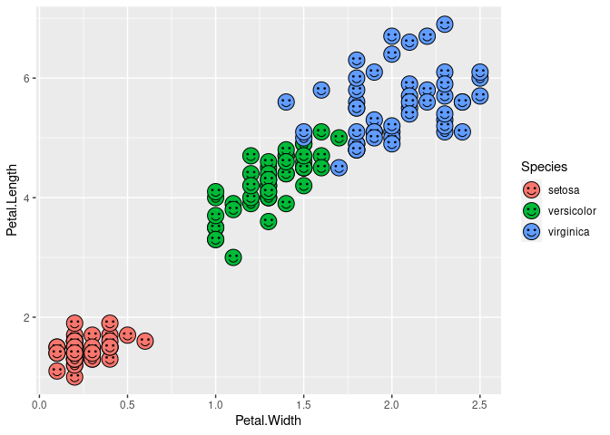
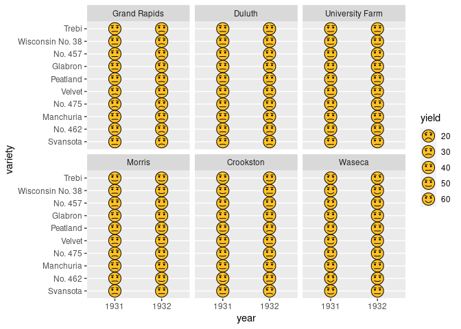
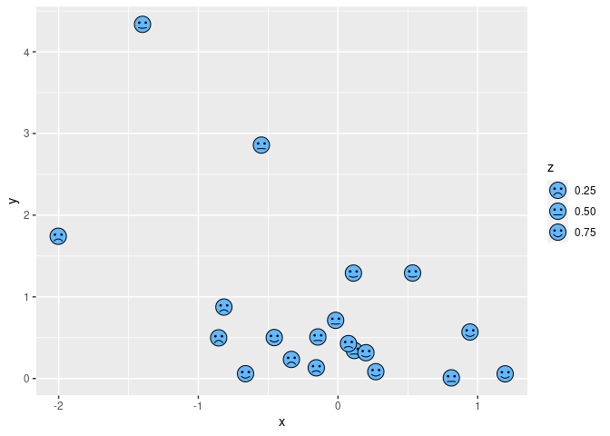

<!-- README.md is generated from README.Rmd. Please edit that file -->
Draw Chernoff faces in ggplot2
==============================

[](https://travis-ci.org/Selbosh/ggChernoff) [](https://ci.appveyor.com/project/Selbosh/ggChernoff) [](https://cran.r-project.org/package=ggChernoff)

This silly package, `ggChernoff`, introduces a `geom_chernoff` geom for [`ggplot2`](http://ggplot2.org). This works a bit like [`geom_point`](http://docs.ggplot2.org/current/geom_point.html), but draws little smiley faces (emoticons) instead of dots.

The Chernoff geom has some unique aesthetics, including `smile`, which makes your faces smile or frown according to the relative magnitude of your continuous variable. By default, the mean value will generate a straight face :expressionless: while higher values will make smiles :blush: and lower values will draw frowns :cry:. You can customise this using `scale_smile`. If `smile` is unmapped to a variable, all faces will be happy by default.

Eyebrows are hidden by default, but you can activate them by mapping something to the `brow` aesthetic. High values make your faces angry :angry: and low values the opposite :anguished:.

Getting started
---------------

Install the package using

``` r
devtools::install_github('Selbosh/ggChernoff')
```

and then load it using

``` r
library(ggChernoff)
```

Examples
--------

Firstly, let's create a scatter plot of smiley faces out of Fisher's iris data set, each one coloured according to species.

``` r
library(ggplot2)
ggplot(iris) +
  aes(Petal.Width, Petal.Length, fill = Species) +
  geom_chernoff()
```



Here is an example using Immer's barley data. We are happy about larger yields!

``` r
ggplot(lattice::barley) +
  aes(year, variety, smile = yield, brow = yield) +
  geom_chernoff(fill = 'goldenrod1') +
  scale_x_discrete(limits = c('1931', '1932')) +
  facet_wrap(~ site)
```



Basic legends are now supported. We can customise breaks and titles in the usual `ggplot2` way, via `scale_smile_continuous`.

``` r
g <- ggplot(data.frame(x = rnorm(20), y = rexp(20), z = runif(20))) +
  aes(x, y, smile = z) +
  geom_chernoff(fill = 'steelblue1')
g
```



``` r
g + scale_smile_continuous('Smilez', breaks = 0:10/10, midpoint = .5)
```


You can also use this command to adjust the range of possible happiness/sadness in your plot. In the following example, everybody is somewhere between sad and straight-faced.

``` r
g + scale_smile_continuous(range = c(-1, 0))
```


Space invaders! :alien:
-----------------------

``` r
cannon <- data.frame(x = 0, y = 0, colour = 'white', size = 20)
bunkers <- data.frame(x = seq(-4, 4, l = 4), y = 2, colour = 'green', size = 1)
ufos <- data.frame(x = rep(seq(-6, 6, length.out = 12), 5),
                   y = rep(6:10, each = 12), size = 10,
                   colour = c('cyan', 'yellow', 'magenta')[
                     c(rep(1:3,4), rep(c(2,3,1),4), rep(c(3,1,2),4), rep(1:3,4), rep(c(2,3,1),4))
                     ],
                   brow = rnorm(60))
ggplot(ufos) +
  aes(x, y, fill = colour, size = size) +
  geom_chernoff(smile = -1, aes(brow = brow)) +
  geom_chernoff(data = cannon) +
  geom_tile(data = bunkers, width = 1) +
  geom_tile(data = data.frame(x = 0, y = 3, colour = 'white', size = 2), width = .1) +
  scale_fill_identity() +
  scale_size_identity() +
  theme_void() +
  theme(plot.background = element_rect(fill = 'black'),
        legend.position = 'none')
```


References
----------

Hermann Chernoff (1973). The use of faces to represent points in *k*-dimensional space graphically. *Journal of the American Statistical Association, 68*(342), 361–368.

Leland Wilkinson (2006). *The Grammar of Graphics* (2nd edition). Springer.
